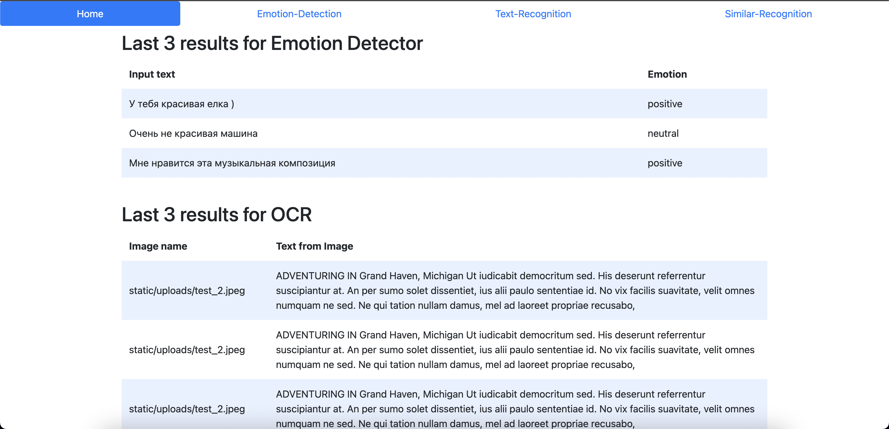
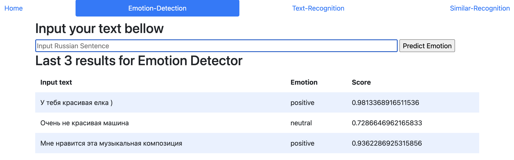
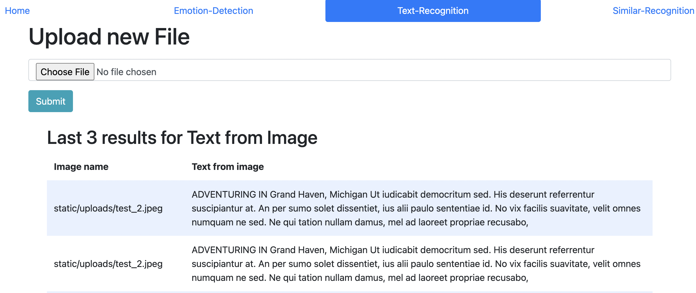
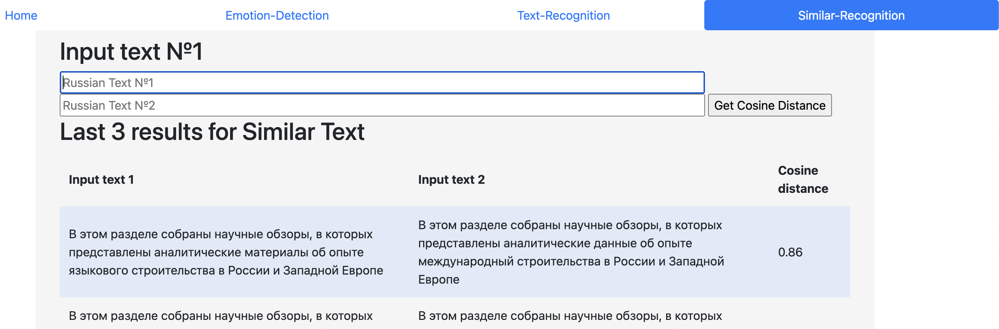

#All ZB 🚀 

Web приложение, которое включает в себя несколько задач по NLP, содержит в себе 4 экрана:
  1. Home - результаты по трем задачам;
  2. Emotion-Detection - классификация Русского текста по эмоциям;
  3. Text-Recognition - распознавание Английского текста на картинке;
  4. Similar-Recognition для сравнения двух текстов;

<div><b>Stack:</b> Python, HTML, CSS, Flask, SQL, Jinja, Pytorch, Tesseract, Bootstrap;</div>

<b>Ссылка на web app:</b> [https://allzb.com](https://3ce3-205-178-20-45.ngrok.io)</div>

## <div align="center">Quick Start Examples</div>

<details open>
<summary>Install</summary>

[**Python>=3.6.0**](https://www.python.org/) is required with all
[requirements.txt](https://github.com/Maximgitman/all_ZB/blob/main/README.md) installed 
Для запуска на локальной машине необходимо скачать веса модели и скопировать их в папку 
[/static/](https://https://github.com/Maximgitman/all_ZB/tree/main/static)
Скачать веса можно по ссылке
[weights_model](https://github.com/Maximgitman/all_ZB/blob/main/README.md) installed 

Чтобы установить на локальной машине:
```bash
$ git clone https://github.com/Maximgitman/all_ZB.git
$ cd all_ZB
$ pip install -r requirements.txt
$ flask run
```

</details>

<details open>
<summary>Home</summary>

На главной странице отображаются результаты со всех трех моделей
*данные берутся из SQL [allzb.db](https://github.com/Maximgitman/all_ZB/blob/main/static/allzb.db)



В базе данных [allzb.db](https://github.com/Maximgitman/all_ZB/blob/main/static/allzb.db) находится 3 таблицы со следующей схемой:

```sqlite3 emotion
# sqlite3 emotion
CREATE TABLE emotion(id INTEGER PRIMARY KEY AUTOINCREMENT, input TEXT NOT NULL, output TEXT NOT NULL, score FLOAT NOT NULL);

# sqlite3 image
CREATE TABLE image(id INTEGER PRIMARY KEY AUTOINCREMENT, image TEXT NOT NULL, text TECT NOT NULL);

# sqlite3 similar
CREATE TABLE similar(id INTEGER PRIMARY KEY AUTOINCREMENT, text_1 TEXT NOT NULL, text_2 TEXT NOT NULL, score FLOAT NOT NULL);
```

</details>

<details>
<summary>Emotion-Detection</summary>
На вкладке Emotion-Detection работает модель по классификации эмоций. 
Вы можете ввести текст на Русском языке после чего данные попадают в базу данных и ваш результат видно ниже в таблице на самой первой строчке.

По умолчанию страница рендерит 3 результат из DB
 

Модель предсказывает только три класса:
  * Neagive (негативный);
  * Positive (позитивный);
  * Neutral (нейтральный).

Модельку одолжил вот по этой ссылке
[rubert-base-cased-sentiment-new](https://huggingface.co/Tatyana/rubert-base-cased-sentiment-new) 
</details>


<details>
<summary>Text-Recognition</summary>

На вкладке Text-Recognition работает распознавание Английского текста на фото форматов .png .jpg .jpeg 
Распознавание происходит на основании библиотеки
[pytesseract](https://pypi.org/project/pytesseract/)

Чтобы загрузить свою картинку, нажмите просто кнопку Choose File после чего необходимо нажать submit.

</details>

<details>
<summary>Similar-Recognition</summary>

На вкладке Similar-Recognition работает 2 примера алгоритма по сравнению двух предложений.
 1. Формируем вектора на основании слов из двух предложений; 
 2. Формируем вектора с помощью натренированной Word2Vec.
    
На вход получаем 2 предложения, после чего представляем их в виде вектора и сравниваем его с помощью косинусного расстояния.
Для того чтобы попробовать, необходимо заполнить два поля, в которых запрашивается два текста для сравнения друг с другом. 


</details>
